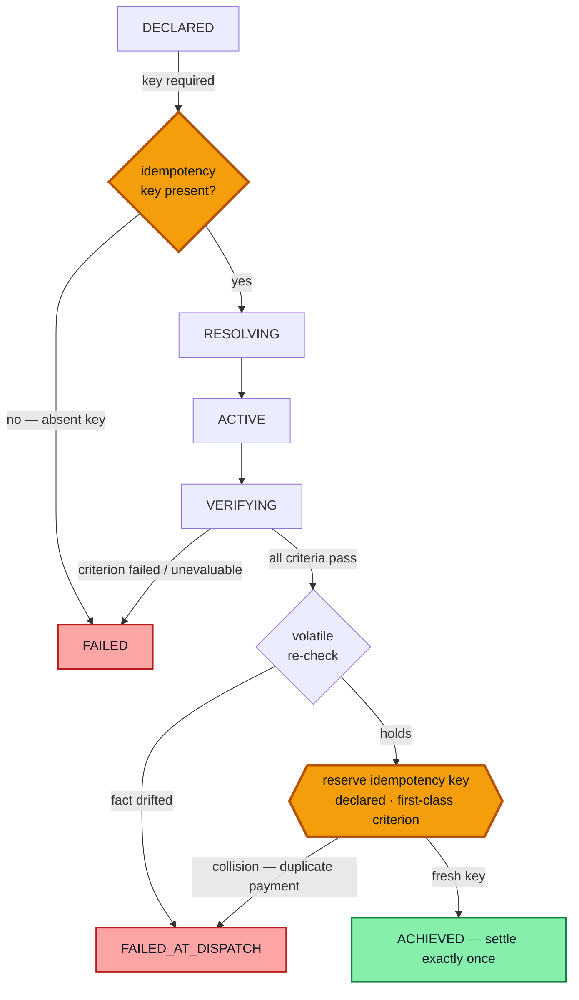

# treasury-intent-controller

The **authorization plane** of the ATLAS Treasury intent-gated action loop. A
deterministic Go gate decides whether an irreversible treasury action — a payment
(class 1) — is authorized. It holds the sole authority to emit `ACHIEVED`; only then
does an adapter record a settlement event. Nothing moves until the gate says so.

The gate reads no artifacts — criteria, thresholds, and the idempotency key arrive as
params. Scoring is fail-closed: any `Fail` or `Unevaluable` denies authorization, and
`Unevaluable` never collapses into a pass. Volatile facts (balance, reachability) are
re-checked at the dispatch edge by the same authority, immediately before authorizing.
Every run is reconstructable from a logical-clock event log and replays byte-identically.

### The distinctive feature — exactly-once *by construction*

What makes two payments "the same payment" is a **declared idempotency key, treated as
a first-class gate criterion** — not adapter-local dedup logic. The key is **required**
(an absent key is unevaluable and fails closed) and is **reserved at the dispatch edge**.
A near-duplicate — same key, one changed field, hence a *different* intent hash —
**collides on the key and is refused** (`FAILED_AT_DISPATCH`). So at-most-once holds on
the settlement log by construction, not by assertion. The amber nodes below are the two
idempotency checkpoints; the key's governance as a signed, expert-attested criterion
lives in the ATLAS `IntentSpec` artifact (a pending slice) — this gate consumes and
enforces it.



Both `FAILED` and `FAILED_AT_DISPATCH` guarantee **no settlement event exists** — the
audit reading is unambiguous: a duplicate or drifted intent ⟹ **no value moved**.

## Invariants (enforced by construction, pinned by tests)

1. The gate is the **sole emitter** of the single, append-only `ACHIEVED` event.
2. **Tri-state, fail-closed** scoring: any `Fail` or `Unevaluable` ⟹ not authorized.
3. **Stable vs volatile**: stable criteria scored once (declaration); volatile scored
   at declaration *and* re-verified at the dispatch edge by the same authority.
4. **Idempotency by construction**: key required; reserved at the dispatch edge; a
   near-duplicate (same key, different intent hash) collides ⟹ `FAILED_AT_DISPATCH`,
   at-most-once on the settlement log.
5. **Determinism / replay**: per-intent logical clock, IDs from the episode seed, no
   wallclock; replay drives the adapter's **recompute** path (not a re-read).

## Layout

| Package | Responsibility |
|---|---|
| `internal/lifecycle` | states + the `validTransitions` graph |
| `internal/intent` | intent / criterion / spec-param data types |
| `internal/audit` | append-only event log + trajectory hash |
| `internal/scoring` | `Scorer` interface, `HTTPScorer` (`/ml/evaluate`), test `FakeScorer` |
| `internal/adapter` | settlement event + idempotent `ReferenceAdapter` |
| `internal/idempotency` | dispatch-edge key reservation store |
| `internal/gate` | the authorization engine + §12 acceptance tests |
| `cmd/server` | thin HTTP shell (`POST /v2/intents`, `GET /healthz`) |

`CONTRACT.md` is the authoritative type/signature contract the implementation codes
against.

## Build & test

```bash
go build ./...
go vet ./...
go test ./... -count=1
```

## Status

**Built and verified** — this is slice 1 of a larger program. The criterion scorer
(`/ml/evaluate`) and the reference adapter are real interfaces here, exercised by
in-package fakes; the production scorer (Python) and the execution-side adapter
(COMPASS/TypeScript) are separate slices, as is the ATLAS `IntentSpec` artifact type
that publishes the criteria this gate consumes.
