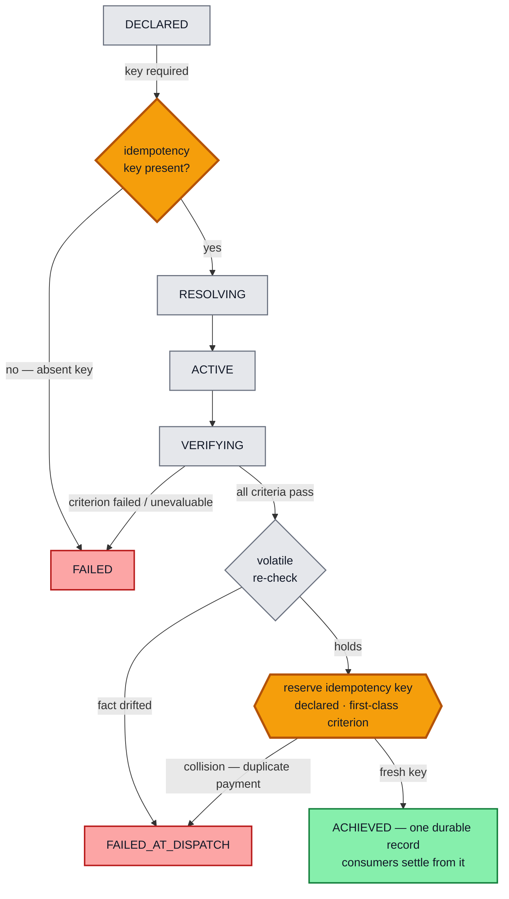
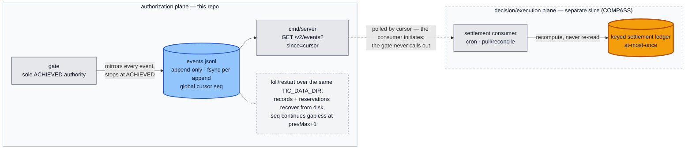

# treasury-intent-controller

The **authorization plane** of the ATLAS Treasury intent-gated action loop. A
deterministic Go gate decides whether an irreversible treasury action — a payment
(class 1) — is authorized. It holds the sole authority to emit `ACHIEVED`, written
exactly once to a durable append-only event feed; the gate itself settles nothing
(**emit-and-observe**) — settlement consumers act only after observing that record.
Nothing moves until the gate says so.

The gate reads no artifacts — criteria, thresholds, and the idempotency key arrive as
params. Scoring is fail-closed: any `Fail` or `Unevaluable` denies authorization, and
`Unevaluable` never collapses into a pass. Volatile facts (balance, reachability) are
re-checked at the dispatch edge by the same authority, immediately before authorizing.
Every run is reconstructable from a logical-clock event log and replays byte-identically;
every event is also mirrored (fsync-per-append) to a durable feed that external
consumers poll by cursor (`GET /v2/events?since=`).

### The distinctive feature — exactly-once *by construction*

What makes two payments "the same payment" is a **declared idempotency key, treated as
a first-class gate criterion** — not adapter-local dedup logic. The key is **required**
(an absent key is unevaluable and fails closed) and is **reserved at the dispatch edge**.
A near-duplicate — same key, one changed field, hence a *different* intent hash —
**collides on the key and is refused** (`FAILED_AT_DISPATCH`). So at-most-once holds on
the settlement log by construction, not by assertion. The amber nodes below are the two
idempotency checkpoints; the key's governance as a signed, expert-attested criterion
lives in the ATLAS `IntentSpec` artifact (a pending slice) — this gate consumes and
enforces it.



Both `FAILED` and `FAILED_AT_DISPATCH` guarantee **no `ACHIEVED` record exists** in the
durable feed — so no consumer ever settles. The audit reading is unambiguous: a
duplicate or drifted intent ⟹ **no value moved**.

## Invariants (enforced by construction, pinned by tests)

1. The gate is the **sole emitter** of the single `ACHIEVED` record, fsynced to the
   durable feed before success; consumers act only after observing it.
2. **Tri-state, fail-closed** scoring: any `Fail` or `Unevaluable` ⟹ not authorized.
3. **Stable vs volatile**: stable criteria scored once (declaration); volatile scored
   at declaration *and* re-verified at the dispatch edge by the same authority.
4. **Idempotency by construction**: key required; reserved at the dispatch edge; a
   near-duplicate (same key, different intent hash) collides ⟹ `FAILED_AT_DISPATCH`,
   at-most-once on the settlement log.
5. **Determinism / replay**: per-intent logical clock, IDs from the episode seed, no
   wallclock; replay drives **recompute** (not a re-read). The feed's global cursor
   (`seq`) never enters the per-intent trajectory hash.
6. **Durability**: the event feed and the idempotency reservations survive process
   restart over the same `TIC_DATA_DIR` (kill/restart proven — byte-identical
   events, same-key re-dispatch still refused).

## Emit-and-observe

The gate's job ends at the durable `ACHIEVED` record. Settlement belongs to a
consumer that **pulls** the feed by cursor and recomputes — the gate never calls
out, and a crash on either side loses nothing:



The amber ledger is the consumer-side twin of the amber checkpoints above: the
same declared key that gates dispatch keys the settlement ledger, so at-most-once
holds end to end.

## Layout

| Package | Responsibility |
|---|---|
| `internal/lifecycle` | states + the `validTransitions` graph |
| `internal/intent` | intent / criterion / spec-param data types |
| `internal/audit` | append-only event log + trajectory hash |
| `internal/durable` | durable JSONL event feed: `GlobalSeq`, fsync-per-append, restart recovery |
| `internal/scoring` | `Scorer` interface, `HTTPScorer` (`/ml/evaluate`), test `FakeScorer` |
| `internal/adapter` | **test-only** reference settlement consumer (recompute path in replay tests) |
| `internal/idempotency` | dispatch-edge key reservation store (in-memory + durable file-backed) |
| `internal/gate` | the authorization engine + §12 acceptance tests |
| `cmd/server` | HTTP shell: `POST /v2/intents`, `GET /v2/events`, `GET /v2/intents/{id}/events`, `GET /healthz`; state under `TIC_DATA_DIR` |

`CONTRACT.md` (slice 1), amended by `CONTRACT-DURABILITY.md` (durability +
emit-and-observe deltas) and `CONTRACT-SCORER.md` (the `/ml/evaluate` wire seam),
are the authoritative type/signature contracts; where they name the same symbol,
the most recent contract wins.

## Build & test

```bash
go build ./...
go vet ./...
go test ./... -count=1
go test ./... -count=1 -race   # needs cgo; on a Windows host without a C compiler, run via WSL
```

## Status

**Built and verified** — slice 1 plus the durability + emit-and-observe refactor.
The gate stops at appending `ACHIEVED`; settlement happens only in a consumer
observing the durable feed (test-only reference consumer in-repo). The criterion
scorer (`/ml/evaluate`) is a real interface exercised by in-package fakes; its
wire seam is **contract-complete** (`CONTRACT-SCORER.md`) with the implementation
planned — the production scorer (Python) and the settlement consumer
(COMPASS/TypeScript) are separate slices, as is the ATLAS `IntentSpec` artifact
type that publishes the criteria this gate consumes.
