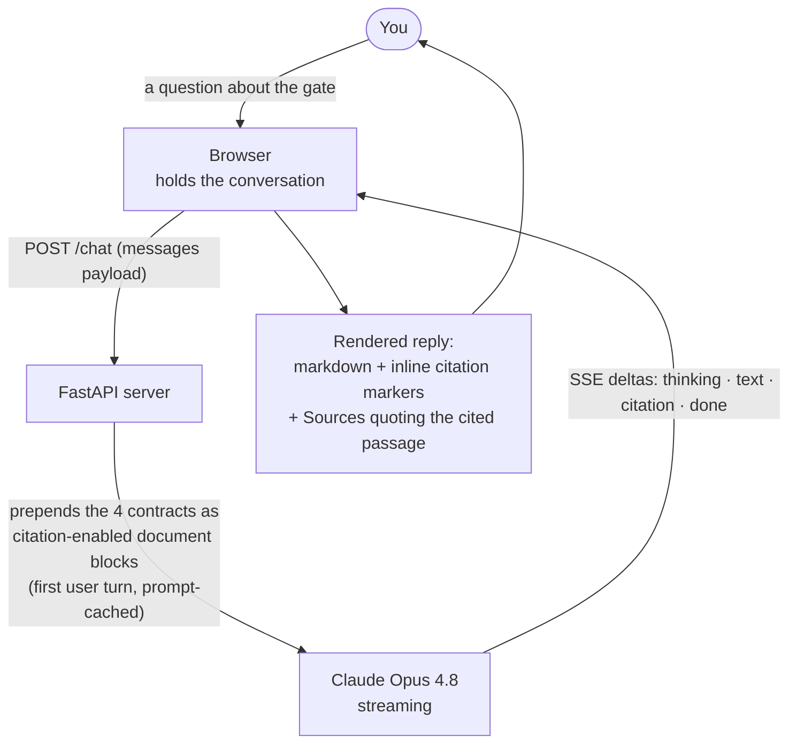

# tic-concept-chat

Local web chat for discussing treasury-intent-controller's design concepts
(intent lifecycle, tri-state fail-closed scoring, idempotency by
construction, stable/volatile criteria, deterministic replay) with Claude
Opus 4.8, primed on the repo's README + CONTRACT.md + CONTRACT-DURABILITY.md +
CONTRACT-SCORER.md.

## Contract-anchored citations

The four docs are attached as citation-enabled `document` blocks, so every
claim Opus makes is anchored to the exact contract passage it rests on. Each
reply shows inline `[n]` markers and a **Sources** list quoting the cited
text and its document. A claim with no citation is visibly Opus's own
inference, not contract text - which keeps the "the contract says" vs "Opus
thinks" boundary in view on every turn. Citations plumb the evidence for a
refute step; they do not perform it - a cited passage still has to actually
support the claim, so read the quote.

> Status: built and unit-tested (`pytest` 9/9), but the live citation stream
> has not been exercised against the API yet - it needs a credentialed turn to
> confirm real replies carry `cited_text` matching the docs. Treat rendering
> as verified only after that smoke.

## How it works

```mermaid
flowchart TD
    U([You]) -->|"a question about the gate"| B["Browser<br/>holds the conversation"]
    B -->|"POST /chat (messages payload)"| S["FastAPI server"]
    S -->|"prepends the 4 contracts as<br/>citation-enabled document blocks<br/>(first user turn, prompt-cached)"| O["Claude Opus 4.8<br/>streaming"]
    O -->|"SSE deltas: thinking · text · citation · done"| B
    B --> R["Rendered reply:<br/>markdown + inline citation markers<br/>+ Sources quoting the cited passage"]
    R --> U
```

Each `citation` delta anchors a span of the reply to the exact passage it rests
on (README, CONTRACT, CONTRACT-DURABILITY, or CONTRACT-SCORER). A claim that
arrives with **no** citation is visibly Opus's own inference, not contract text.
The docs are injected server-side into the first user turn, so the browser
carries only the conversation and the cached prefix stays byte-identical.

## Run

    pip install -r requirements.txt
    uvicorn server:app --port 8765

Open http://localhost:8765. Auth resolves from `ANTHROPIC_API_KEY` or an
`ant auth login` profile - the tool never stores keys.

## Notes

- Stateless server: the browser holds the conversation; refresh loses it.
  Use **Export .md** to save a transcript (sources included).
- The docs are attached as `document` blocks in the first user turn and
  injected server-side, so the browser never carries the full four-document
  context. The prefix is prompt-cached; the usage line under each reply shows
  cache write/read tokens (expect a write on turn 1, reads after).
- Docs are read from `../treasury-intent-controller` at startup (override
  with `TIC_DIR`); the server refuses to start if any doc is missing.
- Design spec: `../treasury-intent-controller/docs/2026-07-05-tic-concept-chat-design.md`

## Test

    python -m pytest -v
