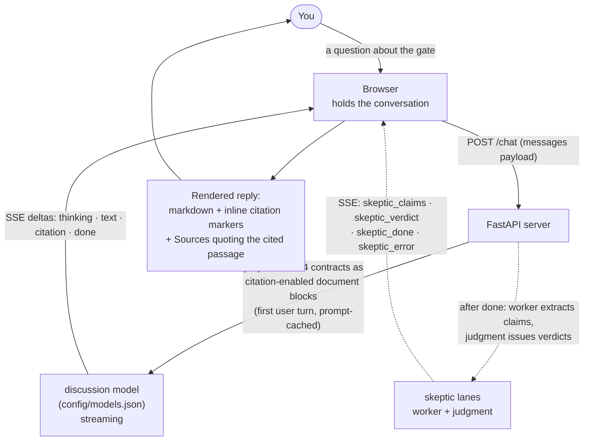

# tic-concept-chat

Local web chat for discussing treasury-intent-controller's design concepts
(intent lifecycle, tri-state fail-closed scoring, idempotency by
construction, stable/volatile criteria, deterministic replay) with Claude
(models per `config/models.json`), primed on the repo's README + CONTRACT.md +
CONTRACT-DURABILITY.md + CONTRACT-SCORER.md.

## Contract-anchored citations

The four docs are attached as citation-enabled `document` blocks, so every
claim the model makes is anchored to the exact contract passage it rests on.
Each reply shows inline `[n]` markers and a **Sources** list quoting the cited
text and its document. A claim with no citation is visibly the model's own
inference, not contract text - which keeps the "the contract says" vs "the
model thinks" boundary in view on every turn. Citations plumb the evidence for a
refute step; they do not perform it - a cited passage still has to actually
support the claim, so read the quote.

> Status: built and unit-tested (`pytest` 35/35), but the live citation stream
> has not been exercised against the API yet - it needs a credentialed turn to
> confirm real replies carry `cited_text` matching the docs. Treat rendering
> as verified only after that smoke.

## Producer≠judge skeptic pass

Each delivered reply is checked by two further lanes on the same SSE stream,
after `done` (the reply is fully delivered first, so skeptic latency or
failure never costs you the answer):

1. **discussion** (producer) — streams the reply, as before.
2. **worker** — mechanically extracts every claim with its citation status
   into a forced-tool JSON schema. No judgment.
3. **judgment** — issues a refutation verdict per claim from the claims JSON
   alone: cited → `supported`/`overreach`, uncited →
   `marked-inference`/`unmarked-inference`. Default is refutation.

The judgment lane sees **excerpts only** (claim text + `cited_text`), never
the full docs or the full reply — the smallest context goes to the most
expensive model. Known limitation, accepted by design: excerpt-only judging
can miss context-dependent overreach.

The producer's framing still asks it to be skeptical — kept as style, no
longer trusted as duty. Verification is mechanical, in lanes 2–3
(`skeptic.py`), so the discussion model is never its own citation-police.

> Status: built and unit-tested offline (mocked API); the live three-lane
> effect is **unverified** — no credentialed run has exercised it.

## How it works

```mermaid
flowchart TD
    U([You]) -->|"a question about the gate"| B["Browser<br/>holds the conversation"]
    B -->|"POST /chat (messages payload)"| S["FastAPI server"]
    S -->|"prepends the 4 contracts as<br/>citation-enabled document blocks<br/>(first user turn, prompt-cached)"| O["discussion model<br/>(config/models.json)<br/>streaming"]
    O -->|"SSE deltas: thinking · text · citation · done"| B
    S -.->|"after done: worker extracts claims,<br/>judgment issues verdicts"| K["skeptic lanes<br/>worker + judgment"]
    K -.->|"SSE: skeptic_claims · skeptic_verdict<br/>· skeptic_done · skeptic_error"| B
    B --> R["Rendered reply:<br/>markdown + inline citation markers<br/>+ Sources quoting the cited passage"]
    R --> U
```

Each `citation` delta anchors a span of the reply to the exact passage it rests
on (README, CONTRACT, CONTRACT-DURABILITY, or CONTRACT-SCORER). A claim that
arrives with **no** citation is visibly the model's own inference, not contract text.
The docs are injected server-side into the first user turn, so the browser
carries only the conversation and the cached prefix stays byte-identical.

## Run

    pip install -r requirements.txt
    uvicorn server:app --port 8765

Open http://localhost:8765. Auth resolves from `ANTHROPIC_API_KEY` or an
`ant auth login` profile - the tool never stores keys.

## Notes

- Stateless server: the browser holds the conversation; refresh loses it.
  Use **Export .md** to save a transcript (sources included).
- The docs are attached as `document` blocks in the first user turn and
  injected server-side, so the browser never carries the full four-document
  context. The prefix is prompt-cached; the usage line under each reply shows
  cache write/read tokens (expect a write on turn 1, reads after).
- Docs are read from `../treasury-intent-controller` at startup (override
  with `TIC_DIR`); the server refuses to start if any doc is missing.
- Model choice is config-centralized (rigor's tier discipline, flattened to
  role -> model): `config/models.json` is the only place a model id lives, and
  a sync test fails if a role is referenced in code but missing from config,
  or sits in config with no code path dispatching it.
- Design spec: `../treasury-intent-controller/docs/2026-07-05-tic-concept-chat-design.md`

## Test

    python -m pytest -v
