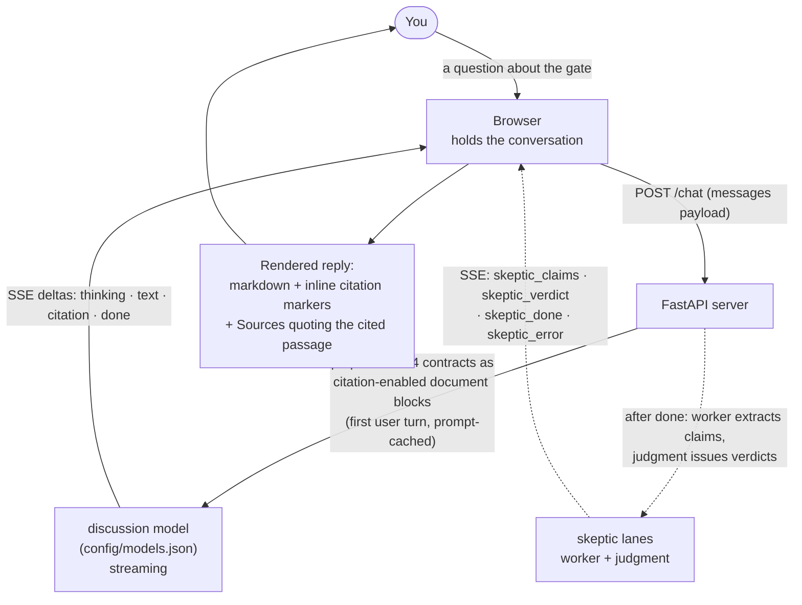

# tic-concept-chat

Local web chat for discussing treasury-intent-controller's design concepts
(intent lifecycle, tri-state fail-closed scoring, idempotency by
construction, stable/volatile criteria, deterministic replay) with Claude
(models per `config/models.json`), primed on the repo's README + CONTRACT.md +
CONTRACT-DURABILITY.md + CONTRACT-SCORER.md.

## Contract-anchored citations

The four docs are attached as citation-enabled `document` blocks, so every
claim the model makes is anchored to the exact contract passage it rests on.
Each reply shows inline `[n]` markers and a **Sources** list quoting the cited
text and its document. A claim with no citation is visibly the model's own
inference, not contract text - which keeps the "the contract says" vs "the
model thinks" boundary in view on every turn. Citations plumb the evidence for a
refute step; they do not perform it - a cited passage still has to actually
support the claim, so read the quote.

> Status: built, unit-tested (`pytest` 35/35), and **live-verified**
> (2026-07-14, `scripts/live_smoke.py`): a real turn carried 13 citation
> deltas, and every `cited_text` was recomputed against the raw bytes of the
> four contracts - each one a literal substring of the document it names, with
> no title outside the attached set. The quotes are real, not plausible.

## Producer≠judge skeptic pass

Each delivered reply is checked by two further lanes on the same SSE stream,
after `done` (the reply is fully delivered first, so skeptic latency or
failure never costs you the answer):

1. **discussion** (producer) — streams the reply, as before.
2. **worker** — mechanically extracts every claim with its citation status
   into a forced-tool JSON schema. No judgment.
3. **judgment** — issues a refutation verdict per claim from the claims JSON
   alone: cited → `supported`/`overreach`, uncited →
   `marked-inference`/`unmarked-inference`. Default is refutation.

The judgment context is config-selected (`config/skeptic.json`,
`judgment_context`). Default is **window**: the judge gets the claims, the
full reply, and a mechanical doc window around each quote - a server-side
substring location, never the full ~18K-token docs and never judge-chosen.
Quotes are located exact-first with a whitespace-tolerant fallback (the
worker lane transcribes quotes and intermittently drifts whitespace -
observed live; fabricated text still fails loud). Residual limitation,
accepted by design: negation or qualification **outside the window radius**,
and context split **across documents**, remain uncatchable. Excerpt-only
mode (claim text + `cited_text` only) is still available in config.

The producer's framing still asks it to be skeptical — kept as style, no
longer trusted as duty. Verification is mechanical, in lanes 2–3
(`skeptic.py`), so the discussion model is never its own citation-police.

> Status: built, unit-tested offline, and **live-verified** (2026-07-14,
> `scripts/live_smoke.py`): on a real reply the worker extracted 24 claims and
> the judgment lane returned 24 verdicts (12 supported, 7 unmarked-inference, 4
> marked-inference, 1 overreach), all arriving after `done`. Crucially the
> judge is **non-vacuous**: fed planted claims, it refuted a cited claim whose
> quote does not carry it (→ `overreach`) and a bald uncited assertion (→
> `unmarked-inference`), while still accepting a self-marked inference (→
> `marked-inference`). It discriminates - it neither rubber-stamps nor
> blanket-refutes.
>
> Window mode is now the default, measured against excerpt-only on the same
> planted set (2026-07-15, `scripts/live_smoke.py`, 19/19 checks). Both modes
> agree on c1-c3 (overreach, unmarked-inference, marked-inference). c4 is the
> doc-inversion trap: a real quote from CONTRACT-DURABILITY.md ("calls
> `adapter.OnAchieved` in-process") whose inverting "no longer " sits just
> outside the excerpt window - window mode catches it, verdict `overreach`;
> excerpt mode calls it `supported`, correctly given its input, since the
> negation isn't in it. Cost: excerpt's planted-set judgment call ran
> in=1150/out=120 tokens, window's ran in=2231/out=387 - roughly 2x the
> tokens to catch what excerpt-only structurally cannot see. On the organic
> 19-claim reply the two modes' verdicts differed on 2/19 claims, including
> one claim excerpt called `overreach` that window, seeing the doc passage,
> resolved as `supported` - window rescues true claims too, not just catches
> inversions. The residual limitation above (outside-window negation,
> cross-document context) is unchanged by this.

## How it works

Each `citation` delta anchors a span of the reply to the exact passage it rests
on (README, CONTRACT, CONTRACT-DURABILITY, or CONTRACT-SCORER). A claim that
arrives with **no** citation is visibly the model's own inference, not contract text.
The docs are injected server-side into the first user turn, so the browser
carries only the conversation and the cached prefix stays byte-identical.

## Run

    pip install -r requirements.txt
    uvicorn server:app --port 8765

Open http://localhost:8765. Auth resolves from `ANTHROPIC_API_KEY` or an
`ant auth login` profile - the tool never stores keys.

## Notes

- Stateless server: the browser holds the conversation; refresh loses it.
  Use **Export .md** to save a transcript (sources included).
- The docs are attached as `document` blocks in the first user turn and
  injected server-side, so the browser never carries the full four-document
  context. The prefix is prompt-cached; the usage line under each reply shows
  cache write/read tokens (expect a write on turn 1, reads after).
- Docs are read from the enclosing repo root (`..`) at startup (override
  with `TIC_DIR`); the server refuses to start if any doc is missing.
- Model choice is config-centralized (rigor's tier discipline, flattened to
  role -> model): `config/models.json` is the only place a model id lives, and
  a sync test fails if a role is referenced in code but missing from config,
  or sits in config with no code path dispatching it.
- Design spec: `../docs/2026-07-05-tic-concept-chat-design.md`

## Test

    python -m pytest -v            # 53 offline tests; the API is mocked

Mocks prove the wiring, never the effect. The credentialed probe is separate:

    python scripts/live_smoke.py   # needs a real key; costs tokens

It boots the server, drives two real turns, recomputes every citation quote
against the raw contract bytes, checks the cached prefix writes then reads, and
feeds the judgment lane planted claims - judged in **both** context modes
(excerpt and window) - whose correct verdicts are known, so a rubber-stamp
judge cannot pass. The planted set includes a doc-inversion trap: a real quote
from CONTRACT-DURABILITY.md whose inverting "no longer " sits just outside any
excerpt, so only window mode can catch it. The run paces its calls, so expect
~6 minutes wall-clock. Last run 2026-07-15: **19/19**. The API's burst limit
trips easily (three model calls per turn); a `Rate limited` result is an
environment answer, not evidence about the app - pause and re-run.
